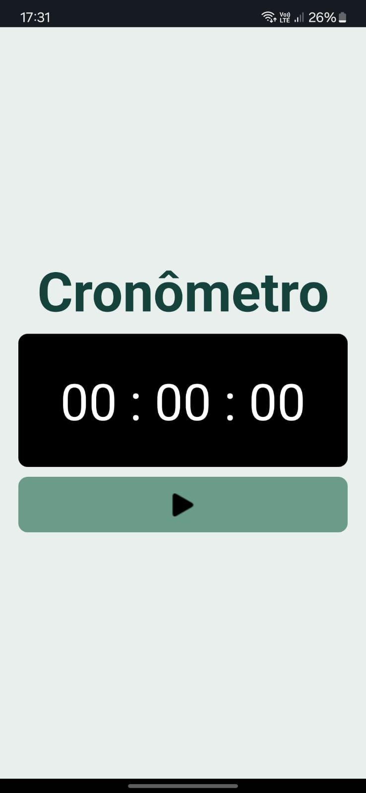

# Cronômetro com React Native

Esse aplicativo é um cronômetro com design simples e intuitivo, desenvolvido especialmente para Android. Foi realizado para a matéria de Desenvolvimento Mobile do curso técnico da ETEC de Guarulhos, 2º módulo.

## Screenshots



## Funcionalidades

- **Iniciar e Parar:** Comece e pause o cronômetro a qualquer momento.
- **Resetar:** Reinicie o cronômetro para zero facilmente.
- **Design Responsivo:** A interface é adaptável e fácil de usar em diferentes tamanhos de tela.

## Tecnologias Utilizadas

- **React Native:** Framework para construção de aplicativos móveis.
- **Expo:** Ferramenta para desenvolvimento rápido de aplicativos React Native.

## Como Instalar

1. Clone o repositório:
    ```bash
    git clone <URL do repositório>
    ```
2. Navegue até o diretório do projeto:
    ```bash
    cd <diretório do projeto>
    ```
3. Instale as dependências:
    ```bash
    npm install
    ```
4. Inicie o projeto:
    ```bash
    npx expo start
    ```
5. Abra o aplicativo no seu dispositivo ou em um emulador:

   - Se estiver com seu Android em mãos, com o aplicativo Expo Go, escaneie o código QR que aparece no terminal.
   - Se estiver usando um emulador, você pode selecionar a opção Android correspondente para iniciar o aplicativo no emulador.
